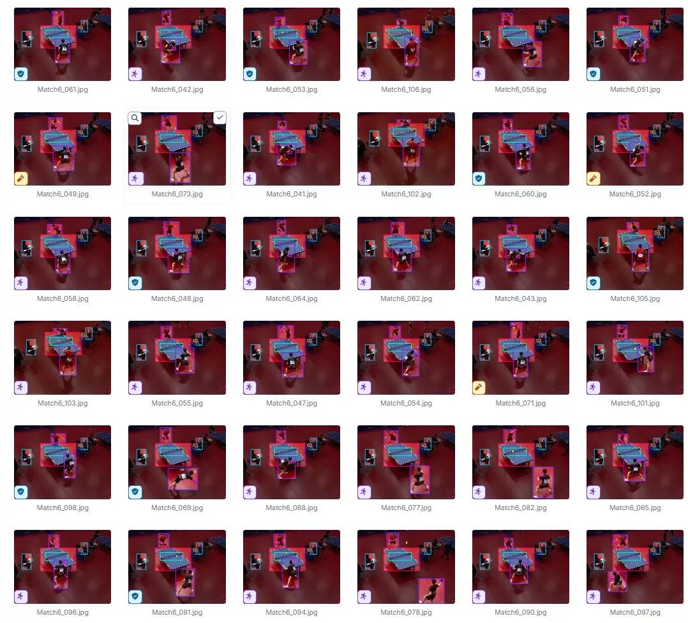
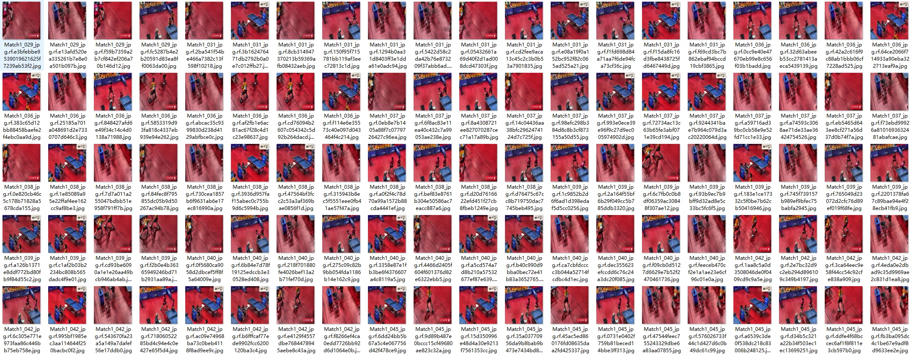
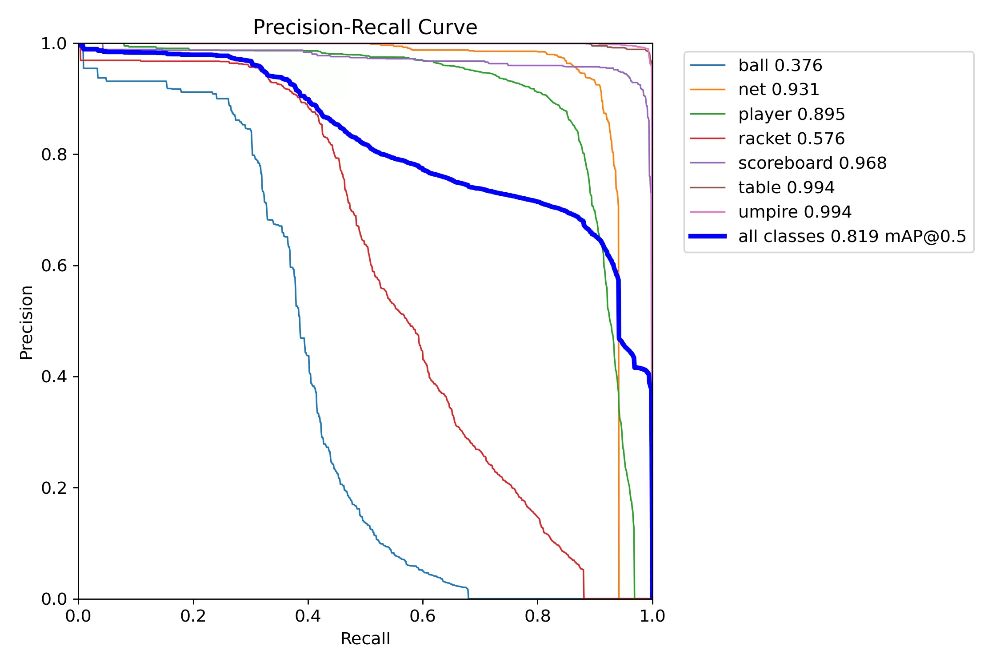
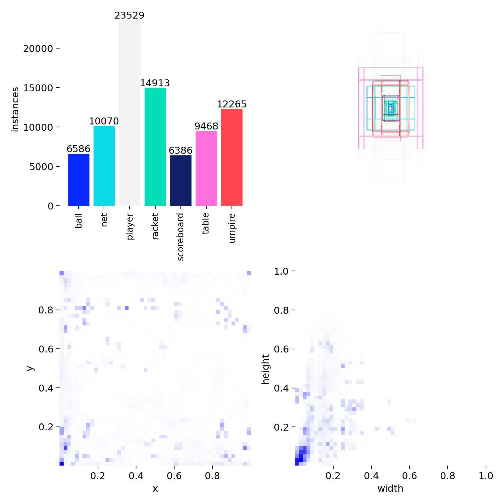
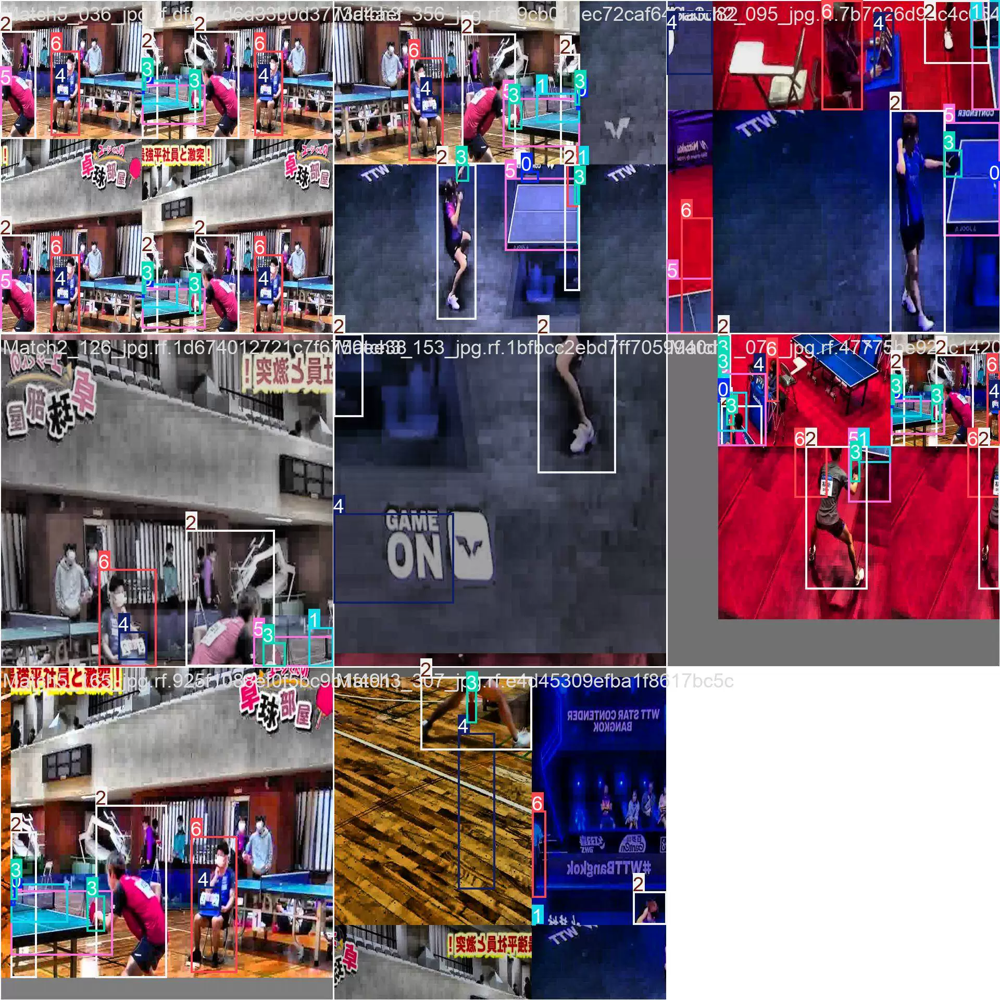
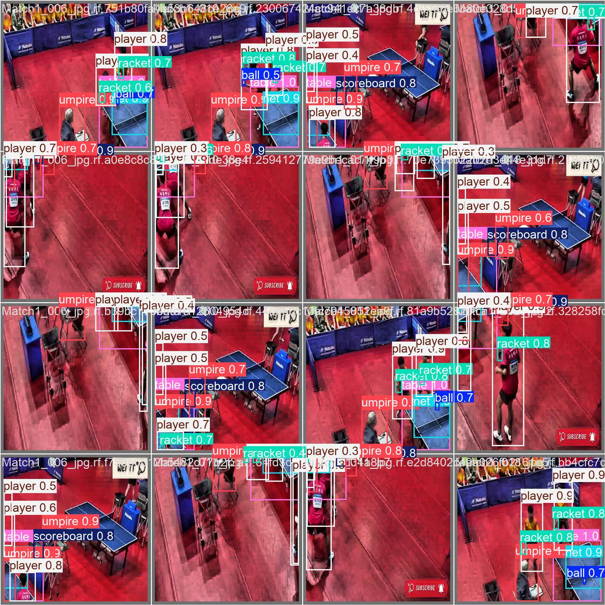
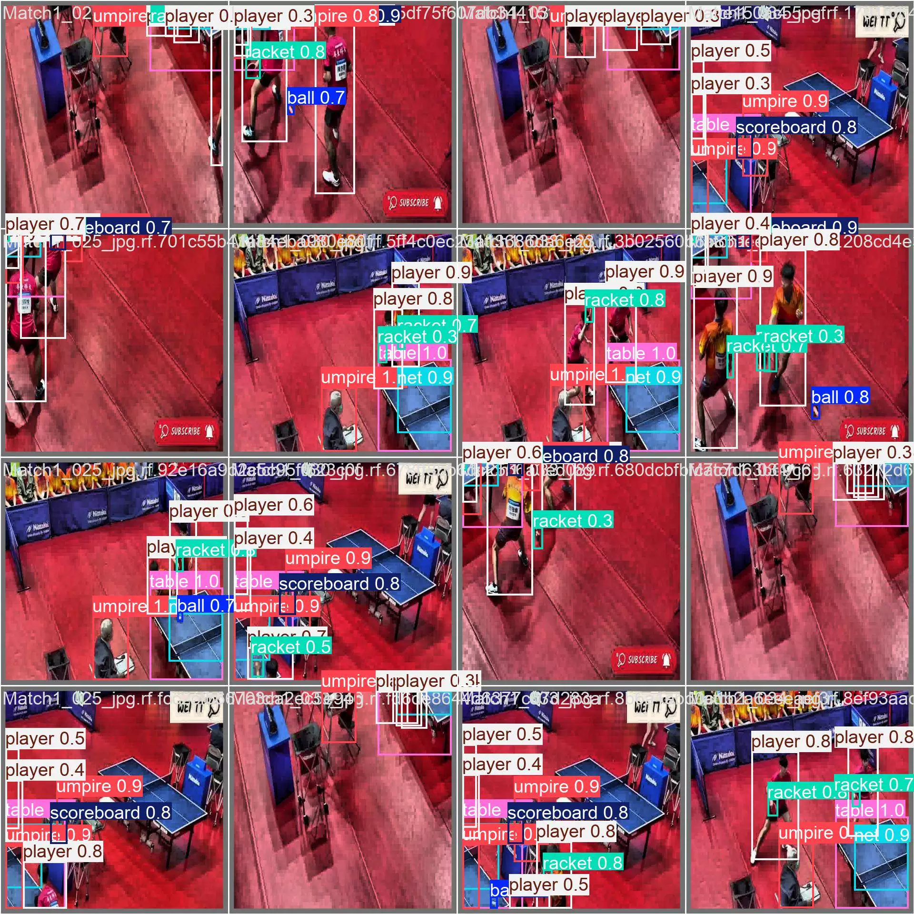

## Body

乒乓球要素识别数据集 YOLO格式

Totally 14,132 images are prepared, each of which is labeled. The YOLO format has been well-defined for training (12,356), validation (1,164) and testing (612).

The dataset is divided into 7 categories: 'ball', 'net', 'player', 'racket', 'scoreboard', 'table', 'umpire'.

YOLOv8s target detection weights file (Training rounds 100, pre-trained model YOLOv8s.pt, mAP@0.5 0.819) with the training results file

## Images

Here is a pay link on Stripe ( https://buy.stripe.com/3cs8yP7sY87d0vu9AB ). Please contact me lonlonago@foxmail.com after funding $89, and I will send you a complete data files , thank you!

